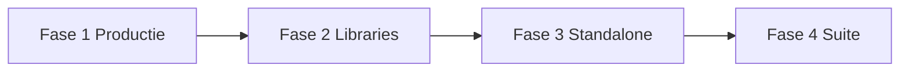

# ProVerlay — Product Roadmap

**Datum:** juni 2026  
**Status:** levend document — bron van waarheid voor productrichting  
**Gerelateerd:** [PRODUCT.md](./PRODUCT.md) · [VMIX.md](./VMIX.md) · [ux/LOWER-THIRD-ROSTER.md](./ux/LOWER-THIRD-ROSTER.md)

---

## Visie

ProVerlay wordt een **lichte, standalone broadcast graphics tool** voor Mac en Windows:

- Klant-branding en PNG-designs als first-class
- Live bediening vanaf desktop + operator (touch)
- Output naar **OBS en vMix** via één render-URL (Chromium browser input)
- Minimalistische UI, **efficiënt** in geheugen en CPU (CEF-vriendelijk)

> Klant branding erin. Overlay live. Score bedienen vanaf iPad. Stream Deck via Companion.

Dit is **geen Holographics-kloon** — wel dezelfde operator-workflow, met eenvoudiger datamodel en focus op design-in-PNG + live data.

---

## Waar we nu staan (baseline)

| Gebied | Status |
|--------|--------|
| Server Node + Express + Socket.io | ✅ Poort **2014** |
| Multi-project (`data/projects/`) | ✅ API + persist |
| Control / operator / render / editor / compose | ✅ |
| Widgettypes (5) | `matchScoreboard`, `customTicker`, `streamCountdown`, `lowerThird`, `message` |
| Compose fase 1 | ✅ PNG → widget wizard |
| Editor | ✅ WYSIWYG, undo, align, 0–100% breedte |
| Live klok (`matchScoreboard`) | ✅ `running` + `runningSince` |
| Companion-module | 🟡 API 2.0; E2E in Companion-app verifiëren |
| Standalone installer | ❌ |
| Lower-third roster | ❌ Ontwerp: [LOWER-THIRD-ROSTER.md](./ux/LOWER-THIRD-ROSTER.md) |
| Logo bug / animatie-presets | ❌ |
| vMix setup-doc | ✅ [VMIX.md](./VMIX.md) |

**Actief project:** `odido` (WK watch-along / StreamNL)

---

## Widget-strategie

### Holographics als referentie (niet als doel)

| Holographics | ProVerlay | Roadmap-fase |
|--------------|-----------|--------------|
| LowerThird + entries | `lowerThird` (losse graphics) | **F2** → roster |
| Ticker + entries | `customTicker` | **F2** uitbreiden |
| Image | `image` (bug QA-001) | **F2** logo placement |
| Countdown / Clock | `streamCountdown` / legacy `clock` | F2 polish |
| BroadcastMessage | `message` | F3 |
| Video | — | F3 stinger |
| Confetti / Particles | — | **Niet** (CEF-kosten) |

### Nieuwe widget-categorieën (na MVP)

| Type | Doel | Fase |
|------|------|------|
| `logoBug` | Sponsorlogo vaste hoek | F2 |
| `animatedGraphic` | PNG/WebP/Lottie + preset animatie | F2–F3 |
| `videoStinger` | WebM/MP4 bump in/uit | F3 |
| `socialLowerThird` | @handle + platform | F4 |
| `schedule` / `nowNext` | Rundown | F4 |

---

## Roadmap-fases



### Fase 1 — Productie-klaar (nu)

**Doel:** Betrouwbare uitzending (ODIDO / watch-along).

- [ ] Companion E2E (toggle, presets, `matchScoreboard`-acties)
- [ ] Render hardening (transparantie, overflow) — zie [VMIX.md](./VMIX.md)
- [ ] QA-001 image zonder `src` overslaan in render
- [ ] QA-007 operator klok-inputs live
- [ ] OBS + vMix handmatige smoke test op Windows én Mac

**Bewust niet:** sync-pagina NPO, OCR live klok, watch-party auto-sync.

---

### Fase 2 — Content & libraries (grootste UX-winst)

**Doel:** Meer sprekers, logo’s, ticker-controle, animaties — zonder zware CEF-load.

| Feature | Beschrijving | Doc |
|---------|--------------|-----|
| **Lower-third roster** | Entries-model i.p.v. 20 losse graphics | [LOWER-THIRD-ROSTER.md](./ux/LOWER-THIRD-ROSTER.md) |
| **Logo placement** | `logoBug` + assets; hoek, schaal, marge | TICKER-COUNTDOWN-SPEC |
| **Ticker uitbreiding** | Font, kleur, separator, preview, pauze | TICKER-COUNTDOWN-SPEC |
| **Animatie-presets** | CSS fade/slide/scale op show/hide | hieronder |
| **Image widget** | Fix + placement in compose | IMAGE-TO-WIDGET-TOOL |

**Animatie-presets (F2):**

- Eerst **CSS** (transform + opacity) — laagste kosten
- Daarna **APNG / animated WebP** via ``
- Later **Lottie** voor vector stingers
- **Geen** particle/confetti-systemen in live render

---

### Fase 3 — Standalone product

**Doel:** Installer Mac + Windows, geen “installeer Node”.

- Desktop shell (Electron of Tauri) met tray-icon
- Gebundelde Node-runtime (Windows verplicht)
- Auto-open `/control` bij start
- Default URL tonen voor vMix/OBS: `http://127.0.0.1:2014/render`
- Compose fase 2 (OCR) optioneel

---

### Fase 4 — Broadcast suite

- CSV import roster (sprekers, sponsors)
- vMix shortcuts / triggers documenteren
- Video stinger widget
- OSC (optioneel, Holographics-pariteit)
- Social / poll widgets (watch-along)

---

## OBS & vMix — één render, twee hosts

ProVerlay levert **HTML/CSS/JS** via lokale URL. OBS en vMix embedden Chromium (CEF).

| Principe | Detail |
|----------|--------|
| Eén gecombineerde bron | `http://127.0.0.1:2014/render` — **voorkeur** (1× CEF) |
| Per-widget bron | `http://127.0.0.1:2014/render?graphic={id}` — voor aparte vMix-overlays |
| Transparantie | Geen `background-color` op `html`/`body`; zie [VMIX.md](./VMIX.md) |
| Resolutie | Match project canvas (standaard 1920×1080) |

---

## Render performance (CEF-regels)

Browser inputs zijn de bottleneck. Alle render-wijzigingen moeten hieraan voldoen.

### Architectuur

| Regel | Reden |
|-------|--------|
| Geen framework in `/render` | Plain DOM — huidige aanpak behouden |
| Max. **één** gecombineerde browser source | Minder CEF-processen |
| Timers stoppen bij `visible: false` | Geen achtergrond-werk |
| `Page Visibility API` | Pauzeer animaties als tab verborgen |
| Ticker: `transform: translate3d()` | GPU, geen layout-thrash |
| Klok: `setInterval` 1 Hz, niet 60 Hz | Minimale DOM-updates |
| Socket: patch alleen gewijzigde graphics | Geen full re-mount |

### Vermijden

- Particle/confetti (Holographics `Particles`, `Confetti`)
- Zware CSS `filter` / geanimeerde `box-shadow`
- `setInterval` die DOM nodes blijft toevoegen
- Meerdere gelijktijdige CSS-animaties op grote layers
- GIF voor animaties (geheugen)
- Embedded YouTube/iframes in render

### Richtcijfers (richtinggevend)

| Scenario | Streven |
|----------|---------|
| 1× `/render`, 3 widgets + ticker | < 150 MB CEF RAM |
| 2 uur live | Geen lineaire geheugengroei |
| CPU ticker | < 5% op moderne laptop |

### OBS-specifiek

- **Shutdown source when not visible:** aan voor zware widgets
- **Hardware acceleration:** aan (Settings → Advanced)
- **Refresh browser when scene becomes active:** bij geheugenproblemen

### vMix-specifiek

- Zie [VMIX.md](./VMIX.md) (transparantie, scrollbars, framerate)

---

## Tickertape — geplande uitbreiding

Huidige velden: `messages[]`, `speed`, `textInsetLeft`, `fadeWidth`, PNG-achtergrond.

| Fase | Toevoeging |
|------|------------|
| 2a | `fontFamily`, `fontSize`, `color`, `separator` |
| 2b | `pauseBetweenMessages`, `direction`, regelhoogte |
| 2c | Per-bericht icoon (project asset) |
| 2d | Live preview + “volgend bericht” op operator |
| 2e | Compose bbox voor tekstzone op ticker-PNG |

---

## Lower thirds — geplande aanpak

**Probleem:** Nu één graphic per spreker → onwerkbaar bij 20+ entries.

**Oplossing:** Holographics-achtig **widget + entries[]** — volledig ontwerp in [LOWER-THIRD-ROSTER.md](./ux/LOWER-THIRD-ROSTER.md).

Kort:

- Eén `lowerThirdShow` widget met template (PNG/CSS)
- Roster `entries[]` met zoeken + CSV import
- Operator: grote knoppen; Companion: preset per entry

---

## Standalone packaging (F3)

```
┌─────────────────────────────────┐
│ ProVerlay.app / ProVerlay.exe   │
│  · tray: Server running :2014   │
│  · Open Dashboard               │
│  · Open Render URL (clipboard)  │
└──────────────┬──────────────────┘
               ▼
        node server/index.js (bundled)
        data/projects/ (user data dir)
```

- **Mac:** `.app` + notarisatie (later)
- **Windows:** installer + gebundelde Node
- User data buiten Program Files (`%AppData%/ProVerlay` / `~/Library/Application Support/ProVerlay`)

---

## Documentatie-index

| Document | Inhoud |
|----------|--------|
| [PRODUCT.md](./PRODUCT.md) | Korte productvisie |
| [ARCHITECTURE.md](./ARCHITECTURE.md) | Technische architectuur (update bij roster) |
| [VMIX.md](./VMIX.md) | vMix Web Browser setup |
| [COMPANION.md](./COMPANION.md) | Stream Deck integratie |
| [ux/COMPOSE-IMPLEMENTATION-PLAN.md](./ux/COMPOSE-IMPLEMENTATION-PLAN.md) | Design-import wizard |
| [ux/TICKER-COUNTDOWN-SPEC.md](./ux/TICKER-COUNTDOWN-SPEC.md) | Ticker & countdown |
| [ux/LOWER-THIRD-ROSTER.md](./ux/LOWER-THIRD-ROSTER.md) | Lower-third roster ontwerp |
| [qa/BLOCKERS.md](./qa/BLOCKERS.md) | Actieve blockers |

---

## Beslissingen (vastgelegd)

| Onderwerp | Besluit |
|-----------|---------|
| NPO/sync-pagina | Niet bouwen; kijkers handmatig syncen |
| OCR live wedstrijdklok | Niet voor broadcast-workflow |
| Confetti/partikels | Niet in scope (performance) |
| Primair output | OBS **en** vMix (CEF HTML) |
| Poort | 2014 (niet 3100) |

---

## Volgende implementatiestap

Na goedkeuring roadmap:

1. **F1 afronden** — Companion + render QA + image bug
2. **F2 starten** — lower-third roster (datamodel + API + operator UI)
