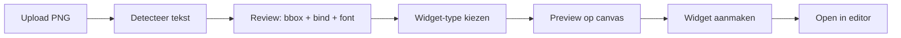

# Image → Widget tool — architectuur & haalbaarheid

**Datum:** 10 juni 2026  
**Status:** Voorstel (nog niet gebouwd)  
**Vraag:** Automatisch tekstregio’s detecteren in klant-PNG’s en omzetten naar live widgets

---

## Kort antwoord

**Ja, het is mogelijk** — maar betrouwbare **font-herkenning uit pixels** is niet realistisch. Wel goed te doen:

- **Positie** van tekstblokken (bounding boxes)
- **Geschatte grootte** (hoogte bbox → `fontSize`)
- **Geschatte kleur** (dominante kleur in bbox)
- **Inhoud** (OCR-tekst → heuristiek voor bind-type: score, klok, teamcode)
- **Font** → default klant-branding; gebruiker kiest handmatig per veld

**Aanbevolen plek:** aparte wizard-pagina **`/compose`** (of `/import`), niet diep in de bestaande editor verstopt. De scorebord-editor blijft voor **finetunen**; de compose-tool voor **eerste conversie**.

---

## Waarom aparte pagina vs. in-editor?

| | In editor-knop | Aparte `/compose` tool |
|--|----------------|------------------------|
| Workflow | Upload PNG in bestaande overlay | Upload → scan → review → nieuwe widget |
| Gebruiker | TD die al een widget heeft | TD/Designer bij **nieuwe klant** |
| OCR-lading | ~2–8 MB Tesseract in editor bundle | Alleen op compose-pagina |
| Widget-types | Alleen scoreboard | Scorebalk, lower third, ticker-strip, … |
| Fouten | Verwarrend (overschrijft bestaande velden) | Veilig: preview vóór aanmaken |

**Hybride (beste UX):**

1. **`/compose`** — primaire “klantdesign → widget” flow  
2. Knop in editor: **“Opnieuw scannen”** — draait detectie op huidige PNG, **voegt** velden toe (niet blind vervangen)

---

## Technische stack (voorstel)

### 1. OCR & regio’s

| Optie | Pro | Con |
|-------|-----|-----|
| **Tesseract.js** (browser) | Geen server, privacy | Traag op grote PNG, bundle size |
| **Tesseract + Sharp** (server) | Sneller, preprocess (contrast, scale) | Node native deps |
| **Cloud Vision API** | Beste accuracy | Kosten, API key, offline nee |

**Aanbevolen fase 1:** server endpoint met `tesseract.js` (pure JS) of `node-tesseract-ocr` + **Sharp** resize naar max 2000px breed.

```text
POST /api/projects/:id/analyze-image
Body: { filename } of multipart upload
Response: {
  width, height,
  regions: [
    { text: "NED", bbox: { x, y, w, h }, confidence: 0.92, suggestedBind: "homeCode" }
  ]
}
```

### 2. Preprocessing (belangrijk voor broadcast PNG’s)

- Resize naar werkbare resolutie  
- Optioneel: alleen **strip crop** als `isStripLayout`  
- Contrast/ grayscale voor OCR  
- Filter regio’s onder confidence-drempel (bijv. &lt; 60%)

### 3. Bind-type heuristiek (geen ML nodig)

| Patroon | Suggestie |
|---------|-----------|
| `^[A-Z]{2,4}$` | `homeCode` / `awayCode` (volgorde: links→home) |
| `^\d+\s*[-–]\s*\d+$` | scores (split of aparte velden) |
| `^\d{1,3}:\d{2}$` of `\d+\+\d+` | `clock` |
| Overige korte strings | `custom` |

Gebruiker **bevestigt** altijd in review-stap (checkboxes + dropdown per regio).

### 4. Font & kleur

- **Font:** altijd `brand.fontFamily` of project font dropdown — **niet** uit OCR  
- **Grootte:** `fontSize ≈ bbox.height × (refWidth / canvasWidth) × factor`  
- **Kleur:** sample gemiddelde RGB in bbox (ignore anti-aliasing rand)

### 5. Widget aanmaken

Bestaande API hergebruiken:

```text
POST /api/graphics  { type, name }
PATCH /api/graphics/:id  { data: { layout, elements } }
```

Compose-tool maakt na review één graphic + upload PNG naar assets.

---

## UI-flow (wizard)



**Schermen:**

1. **Upload** — PNG + widget-type (wedstrijdscore / lower third / …)  
2. **Detectie** — overlay met boxes op afbeelding; lijst links  
3. **Koppelen** — per regio: bind, font, kleur (defaults ingevuld)  
4. **Plaatsing** — strip placement sliders (zelfde als editor)  
5. **Aanmaken** — POST widget → redirect `/editor?graphic=…`

---

## Inspanning (indicatie)

| Onderdeel | Effort |
|-----------|--------|
| Server analyze endpoint + Tesseract | 2–3 dagen |
| Compose UI (3 stappen) | 2–3 dagen |
| Heuristieken + kleur/grootte | 1 dag |
| Integratie editor “Opnieuw scannen” | 0.5 dag |
| Tests met ODIDO assets | 1 dag |

**Totaal MVP:** ~1–1.5 week

---

## Risico’s & mitigatie

| Risico | Mitigatie |
|--------|-----------|
| OCR faalt op gradient tekst (ODIDO) | Preprocess + handmatig veld toevoegen blijft |
| Verkeerde bind voorgesteld | Review verplicht; nooit auto-live |
| Zware PNG (4K) | Server-side downscale |
| Ticker / scroll tekst | Apart type: geen OCR, alleen PNG + messages |

---

## Wat al bestaat in ProVerlay

- WYSIWYG editor met `%` + `refWidth` (WYSIWYG met render)  
- `defaultStripSlots()` — handmatige auto-plaats  
- Referentie-overlay — visueel afstemmen zonder OCR  
- **Pijltjestoets-nudge** — 1px / Shift 10px (`wysiwyg-nudge.js`)

---

## Volgende stap

1. Besluit: `/compose` route + menu-link op dashboard (“Design importeren”)  
2. MVP endpoint `analyze-image` met Tesseract  
3. Wizard alleen voor `matchScoreboard`  
4. Daarna lower third + message types
