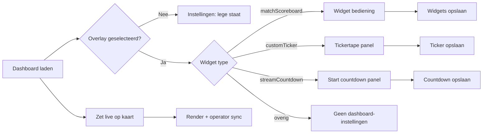

# UX Review Pass — Dashboard, Operator, Editor, Project

**Datum:** 10 juni 2026  
**Agent:** UX/UI Designer (agent 2)  
**Scope:** `/control`, `/operator`, `/editor`, `/project`  
**Referenties:** `UX-DESIGN-BRIEF.md`, `CONTROL-WIREFRAME.md`, `frontend-design/REFERENCE.md`, `WIDGET-CONTROLS-REVIEW.md`

**Doel:** Overlay select → inspector → live toggle binnen **30 seconden**; Nederlandse copy; progressive disclosure; operator mobile flows; render-URL vindbaarheid; project canvas UX.

---

## Executive summary

| Route | Score | Blokker voor &lt;30s |
|-------|-------|----------------------|
| `/control` | 🟢 | — |
| `/operator` | 🟢 | — |
| `/editor` | 🟢 | — |
| `/project` | 🟢 | — |

**Update 10 juni 2026 (implementatie):** Alle Critical- en Suggestion-items uit deze review zijn doorgevoerd in `public/control`, `public/operator`, `public/editor` en `public/project`. Zie §9.

**Sterk:** Live toggle direct op overlay-kaart (geen inspector vereist); widget-specifieke inspector-panels; per-overlay Render URL + kopieer; `?focus=` op operator; lege inspector-states; `showNames` checkbox aanwezig; operator iOS 16px inputs.

---

## 1. Flow — overlay select → inspector → live toggle

### Beoordeling

| Stap | Gedrag | Status |
|------|--------|--------|
| 1. Overlay zichtbaar | Lijst links, kaart toont type + naam + acties | ⚠️ Type is interne ID |
| 2. Selecteren | Klik op kaart → `is-selected` border, inspector opent | ✅ |
| 3. Inspector | Leeg: “Selecteer een overlay…”; per type: Widget / Ticker / Countdown | ✅ |
| 4. Live zetten | **Zet live** / **On air** op kaart, geen inspector nodig | ✅ (&lt;30s haalbaar) |

### Flow (huidige implementatie)



### Findings

| Severity | Finding |
|----------|---------|
| **Critical** | Overlay-kaarten tonen **`graphic.type`** (`matchScoreboard`, `customTicker`, …) i.p.v. Nederlandse soortnaam. Zie `control.js` regel ~258. Dropdown “Soort widget” gebruikt wél goede labels — inconsistentie. |
| **Critical** | Sidebar-volgorde: **Netwerk → Project → Branding → Instellingen → Widget panels**. Op laptop moet TD scrollen vóór widget-instellingen zichtbaar zijn. Wireframe-doel “graphic live in &lt;2s” haalbaar voor toggle; **configureren** niet binnen 30s als scroll nodig is. |
| **Suggestion** | Geen auto-select van eerste overlay bij laden — nieuwe gebruiker ziet lege inspector zonder context welke overlay actief is. |
| **Suggestion** | **Widgets opslaan** vereist submit voor visibility-checkboxes; toggles voelen niet instant (zie `WIDGET-CONTROLS-REVIEW.md` P1). |
| **OK** | Live toggle los van inspector — primaire operator-actie blijft één klik. |
| **OK** | **Bedienen** link op kaart → `/operator?focus={id}` sorteert juiste overlay bovenaan. |

### Aanbevolen flow-verbeteringen (prioriteit)

1. **P0:** Vervang `graphic.type` door label-map (zelfde als widget-add defaults: Wedstrijdscore, Tickertape, …).
2. **P1:** Verplaats **Instellingen + widget panels** direct onder header of koppel expandable sectie op overlay-kaart.
3. **P1:** Collapse Netwerk/Project/Branding achter “Setup” accordeon na eerste gebruik.

---

## 2. Labels & copy — Nederlands, geen implementatienamen

### Findings

| Severity | Locatie | Huidig | Aanbevolen |
|----------|---------|--------|------------|
| **Critical** | Overlay-kaart type-regel | `matchScoreboard` | Wedstrijdscore |
| **Critical** | Overlay-kaart type-regel | `customTicker` | Tickertape |
| **Critical** | Overlay-kaart type-regel | `streamCountdown` | Start countdown |
| **Suggestion** | Live-knop / operator status | On air / Niet live | **Live** / **Uit** (of bewust Engels broadcast-jargon documenteren) |
| **Suggestion** | Branding kleuren | Primary / Secondary | **Primair / Secundair** ✅ HTML gefixt |
| **Suggestion** | Widget toevoegen | Lower third | Lower third (brancheterm OK) of **Naam + titel** |
| **Suggestion** | Editor inspector | Koppeling (data) | **Databron** of **Veld koppelen aan** |
| **Suggestion** | Editor foutmelding (`editor.js`) | footballScore overlay | **wedstrijdscore-overlay** |
| **Suggestion** | Operator penalty knoppen | goal / mis | **Goal** / **Mis** (OK) of **Raak** / **Mis** |
| **Suggestion** | Dashboard | Widget type | **Soort widget** ✅ HTML gefixt |
| **OK** | Widget panel | Thuis code, Speeltijd, Penalty-balk | Consistent Nederlands |
| **OK** | Project pagina | Render canvas, presets 1080p/4K/9:16 | Duidelijk |
| **OK** | Operator lege staat | Geen operator-overlays geconfigureerd | Duidelijk |

### Copy-tabel (aanbevolen standaard)

| Intern (`type`) | UI-label overlay-kaart | Operator-kaart titel |
|-----------------|------------------------|----------------------|
| `matchScoreboard` | Wedstrijdscore | `{graphic.name}` |
| `customTicker` | Tickertape | `{graphic.name}` |
| `streamCountdown` | Start countdown | — (geen operator) |
| `lowerThird` | Lower third | — |
| `message` | Bericht | — |
| `footballScore` | *(legacy — verbergen)* | Legacy score |

---

## 3. Progressive disclosure

### Dashboard (`/control`)

| Element | Gedrag | Status |
|---------|--------|--------|
| `#inspector-empty` | Zichtbaar zonder selectie | ✅ |
| `#widget-panel` | Alleen bij `matchScoreboard` | ✅ |
| `#ticker-panel` | Alleen bij `customTicker` | ✅ |
| `#countdown-panel` | Alleen bij `streamCountdown` | ✅ |
| Netwerk / Project / Branding | Altijd zichtbaar | ⚠️ Setup-chrome concurreert met inspector |

**Suggestion:** Toon alleen **Instellingen**-stack in sidebar tot overlay geselecteerd; setup-panels in collapsible “Project & netwerk”.

### Editor (`/editor`)

| Element | Gedrag | Status |
|---------|--------|--------|
| `#inspector-empty` | “Selecteer een tekstveld op het canvas.” | ✅ |
| `#inspector-form` | Hidden tot selectie | ✅ |
| Auto-plaats velden | Hidden tot strip-layout + matchScoreboard | ✅ |

**Suggestion:** Lege overlay-select hint als geen scoreboard beschikbaar.

### Operator (`/operator`)

| Element | Gedrag | Status |
|---------|--------|--------|
| Cards | Alleen `graphic.operator === true` | ✅ |
| Penalty-sectie | Altijd zichtbaar op matchScoreboard | ⚠️ |
| Legacy `footballScore` | Apart template, minder controls | ⚠️ Documenteer/verberg |

---

## 4. Operator mobile flows

### `?focus=` parameter

| Aspect | Status |
|--------|--------|
| Leest `focus` uit URL | ✅ |
| Sorteert gefocuste graphic eerst | ✅ |
| Zet `#op-title` op eerste kaartnaam | ✅ |
| Dashboard **Bedienen** link stuurt `?focus=` | ✅ |

**Suggestion:** Toon subtiele “Gefocust: {naam}” chip in operator-header wanneer `focus` actief is (nu alleen via paginatitel).

### Hiërarchie score / klok / penalties

```
┌─────────────────────────────────┐
│ Titel + status (score duplicate)│  ← Suggestion: status alleen Live/Uit
├─────────────────────────────────┤
│  THU  │  45:23  │  UIT          │  ✅ Score + klok dominant
│  +/-  │  periode│  +/-          │
├─────────────────────────────────┤
│ Minuut | Seconde | Periode       │  ⚠️ Inputs onder score (OK voor correctie)
├─────────────────────────────────┤
│ −15s +15s −1min +1min           │  ⚠️ 6 knoppen, mis-tap risico
│ Start/Pauze | 90+ | On air      │
├─────────────────────────────────┤
│ Penalties (altijd)              │  ⚠️ Collapse als widget uit / inactief
└─────────────────────────────────┘
```

| Severity | Finding |
|----------|---------|
| **OK** | Touch targets ≥52px; safe-area bottom nav; `touch-action: manipulation` |
| **OK** | iOS anti-zoom: `font-size: 16px` op clock inputs (`operator.css`) |
| **OK** | `.op-http-hint` verwijderd uit HTML (netwerk-uitleg alleen dashboard) |
| **Suggestion** | `.op-status` herhaalt score naast grote score-blokken — houd alleen live-status |
| **Suggestion** | Penalty toolbar: 6 knoppen; verberg sectie als `widgets.penalties === false` |
| **Suggestion** | Toolbar groeperen: klok ± op rij 1; start/pauze + 90+ rij 2; on air full-width |

---

## 5. Per-widget render URLs — vindbaarheid

| Mechanisme | URL | Status |
|------------|-----|--------|
| Header **Render URL** | `{origin}/render` (alle overlays) | ✅ maar onduidelijk vs per-widget |
| Kaart **Render URL** knop | `{origin}/render?graphic={id}` + clipboard | ✅ |
| Hover `title` op kaartknop | Volledige URL | ✅ |
| Editor Preview link | `renderUrl(graphic.id)` | ✅ |
| Netwerk panel | Operator URLs per IP | ✅ |

| Severity | Finding |
|----------|---------|
| **Critical** | Twee knoppen heten **Render URL** met verschillende scope — verwarrend voor OBS-setup. |
| **Suggestion** | Header hernoemen naar **Alle overlays (render)**; kaart naar **Deze overlay (OBS)**. |
| **OK** | Note-panel in dashboard uitgebreid met uitleg per-kaart vs header (copy-fix 10 jun). |

---

## 6. Project canvas resolution UX

| Aspect | Status |
|--------|--------|
| Standaard 1920×1080 | ✅ |
| Presets: 1080p, 4K, Verticaal 9:16 | ✅ |
| Copy: OBS browser source moet matchen | ✅ |
| Validatie min/max 360–7680 | ✅ |
| Aspect-ratio preview | ✅ |
| Waarschuwing bij wijziging na overlays | ✅ Confirm-dialog |
| Koppeling naar editor canvas | ✅ Link na opslaan |

| Severity | Finding |
|----------|---------|
| **Suggestion** | Toon live **aspect ratio label** (bijv. “16:9 · 1920×1080”) naast presets. |
| **Suggestion** | Confirm-dialog bij afwijkende ratio: “Bestaande overlay-posities kunnen verschuiven.” |
| **Suggestion** | Link “Open editor om layout te controleren” na opslaan. |
| **OK** | `/project` copy is duidelijk voor TD; presets dekken hoofd-use-cases. |

---

## 7. Editor — aanvullende bevindingen

| Severity | Finding |
|----------|---------|
| **OK** | Canvas-first layout; inspector rechts; lege staat aanwezig |
| **OK** | Overlay-select in header; Opslaan primair |
| **Suggestion** | Bind-opties voor matchScoreboard missen `homeCode`, `awayCode`, `clock` in UI (wel in auto-slots) — uitbreiden dropdown |
| **Suggestion** | Upload hint noemt “800×80” — voeg “of volledige 1920×1080 strip” toe voor consistentie met project canvas |

---

## 8. Wijzigingen in deze pass

### HTML copy (toegepast)

| Bestand | Wijziging |
|---------|-----------|
| `public/control/index.html` | Primary/Secondary → Primair/Secundair |
| `public/control/index.html` | “Widget type” → “Soort widget” |
| `public/control/index.html` | Overlays intro + Operator & render note (per-widget URL uitleg) |
| `public/operator/index.html` | Sync → Live sync |

### Documentatie

| Bestand | Actie |
|---------|-------|
| `docs/ux/UX-REVIEW-PASS.md` | **Nieuw** — dit document |
| `docs/ux/WIDGET-CONTROLS-REVIEW.md` | Ongewijzigd; widget/klok detail blijft daar |

### Niet gewijzigd (lead / frontend design)

- Server API, render logic

---

## 9. Geïmplementeerd (10 juni 2026)

| Item | Bestanden |
|------|-----------|
| Nederlandse type-labels op overlay-kaarten | `control.js` (`TYPE_LABELS`) |
| Render URL semantiek: **Alle overlays (render)** vs **Deze overlay (OBS)** | `control/index.html`, `control.js` |
| Inspector boven setup; **Project & netwerk** accordeon (dicht) | `control/index.html`, `control.css` |
| Auto-select eerste overlay bij laden | `control.js` |
| Instant apply widget visibility checkboxes | `control.js` |
| Klok Start/Pauze visuele staat bij lopende klok | `control.js` |
| Live-knop copy **Live / Uit** | `control.js`, `operator.js` |
| Operator focus-chip bij `?focus=` | `operator/index.html`, `operator.js`, `operator.css` |
| Statusregel i.p.v. score-duplicaat in header | `operator.js` |
| Penalty-sectie verborgen bij `widgets.penalties === false` | `operator.js` |
| Toolbar: klok apart van Live-knop | `operator.js`, `operator.css` |
| Editor: **Veld koppelen aan** + `period` bind | `editor/index.html`, `editor.js` |
| Editor upload hint 3197×335 / 1920×1080 | `editor/index.html` |
| Editor foutmelding wedstrijdscore | `editor.js` |
| Canvas aspect-ratio label live | `project/index.html`, `project.js`, `project.css` |
| Confirm bij canvas-wijziging + editor-link | `project.js` |

---

## Prioriteitenmatrix

| Critical | Suggestion | OK |
|----------|------------|-----|
| ~~Interne type-IDs op overlay-kaarten~~ | ~~Sidebar scroll / inspector positie~~ | Progressive disclosure per widget |
| ~~Dubbele “Render URL” semantiek~~ | ~~Operator status/score duplicaat~~ | Live toggle op kaart |
| | ~~Penalty altijd zichtbaar~~ | focus param + Bedienen link |
| | ~~Canvas aspect preview~~ | showNames checkbox |
| | ~~Instant apply widget toggles~~ | iOS 16px operator inputs |
| | ~~Editor bind labels~~ | Project presets + OBS copy |

---

## Verwijzingen

- Widget/klok detail & P0 backlog: `docs/ux/WIDGET-CONTROLS-REVIEW.md`
- Control layout (verouderd): `docs/ux/CONTROL-WIREFRAME.md` — update P2
- Project flows: `docs/ux/PROJECT-UX.md`
- Editor spec: `docs/ux/EDITOR-WYSIWYG.md`
